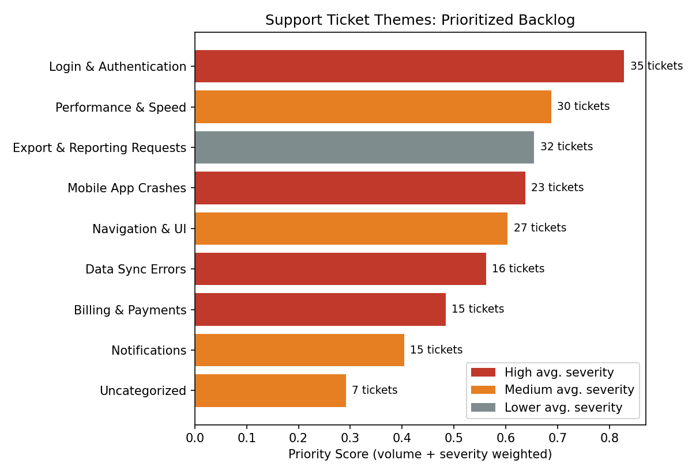

# Customer-Feedback-Theme-Analyzer
Built a taxonomy-based classifier (Python, Pandas) to categorize and prioritize support ticket themes by volume and severity; achieved 96.5% classification accuracy across 200 simulated tickets, surfacing a data-driven "fix this first" backlog. A small product case study: turning unstructured user feedback into a
prioritized, defensible backlog — the same kind of work I did informally
providing feedback on internal tools (Salesforce, Coach360) during my time
at Dell, formalized here into a repeatable method.

## The Problem

Support tickets and user feedback arrive as free text with no built-in
structure. Reading through hundreds of tickets one at a time to spot
patterns doesn't scale, and without a system, it's easy to prioritize
based on whichever complaint was loudest or most recent — not what's
actually affecting the most users or causing the most damage.

## The Approach

1. **Classify** each ticket into a theme using a defined taxonomy (keyword
   matching against 8 known issue categories).
2. **Score** each theme using two factors:
   ```
   priority_score = 0.6 × volume_normalized + 0.4 × severity_normalized
   ```
3. **Rank** themes to produce a "fix this first" backlog.

### Why volume 60% / severity 40%?
Volume is weighted higher because an issue affecting many users usually
represents broader risk (churn, support cost, reputation) even at moderate
severity. Severity still matters enough to pull a smaller-but-nastier issue
up the list — a rare "we billed you twice" complaint shouldn't get buried
under a large pile of low-stakes UI feedback. Like the weights in my
dispatch project, these are a starting point meant to be validated against
real outcomes (e.g., which past fixes actually moved retention or reduced
ticket volume).

### Why a keyword taxonomy instead of machine learning clustering?
I tested unsupervised clustering (TF-IDF + KMeans) first, expecting it to
automatically discover themes. On this dataset it produced messy, mixed
clusters that were hard to interpret or trust — a real risk with
unsupervised methods on short, similar text. A defined taxonomy is
transparent: anyone reviewing the output can see exactly *why* a ticket
was categorized the way it was, which matters when the output is being
used to justify what engineering works on next. It also mirrors how real
support and feedback teams typically operate — categories are usually
defined by domain knowledge, not discovered from scratch.

## Results (200 simulated tickets)

**96.5%** of tickets were successfully classified into a known theme.

| Rank | Theme                        | Volume | Avg. Severity | Priority Score |
|------|-------------------------------|--------|----------------|-----------------|
| 1    | Login & Authentication        | 35     | 2.14           | 0.829           |
| 2    | Performance & Speed            | 30     | 1.87           | 0.688           |
| 3    | Export & Reporting Requests    | 32     | 1.53           | 0.655           |
| 4    | Mobile App Crashes             | 23     | 2.22           | 0.638           |
| 5    | Navigation & UI                | 27     | 1.70           | 0.604           |



**Login & Authentication** ranks #1 — high volume *and* high severity make
it the clearest case for immediate engineering attention, ahead of themes
with either higher volume alone (Export requests) or higher severity alone
(Data Sync Errors).

## Files

- `generate_data.py` — creates a realistic sample dataset of support tickets
- `analyze.py` — taxonomy classifier + volume/severity prioritization scoring
- `make_chart.py` — generates the prioritized backlog chart
- `support_tickets.csv` — the generated dataset used for this run
- `tickets_with_themes.csv` — every ticket with its assigned theme
- `theme_priority_ranking.csv` — the final ranked backlog

## What I'd Do Next (Given Real Data)

- Run clustering on the **Uncategorized** bucket specifically, to surface
  emerging issues the current taxonomy doesn't have a category for yet.
- Validate the 60/40 volume/severity weighting against real outcomes —
  e.g., which past fixes had the biggest measurable impact.
- Add a time dimension to catch *trending* themes (rising ticket volume
  week over week), not just total volume, since a fast-growing issue can
  matter more than a big-but-stable one.
- Bring in a real severity signal (e.g., linked churn or refund data)
  instead of a manually assigned severity label.

## Why I Built This

At Dell, I regularly submitted structured feedback on internal
applications (Salesforce, Coach360), surfacing recurring pain points for
the development team. This project formalizes that instinct into a
repeatable, scalable method — the same kind of prioritization judgment
I'd want to bring to backlog decisions as a Product Manager.

